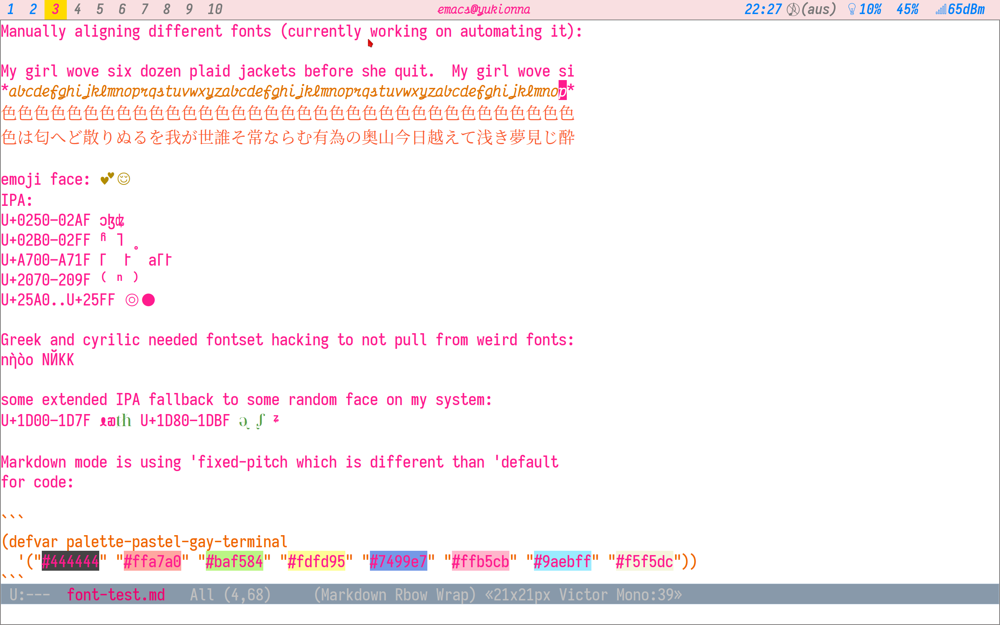

# show-font-mode

Emacs mode to display in the modeline the low-level font being used at
point, along with its effective pixel dimensions or other properties.

Also provided is `show-font-mode-overlay`, which will paint each
on-screen font in a different tint.  This should help debug unwanted
fallback fonts.

I made this to debug complex issues with fontsets not doing quite what
I wanted, custom faces being very annoying to save programatically &c.

〜Melissa
